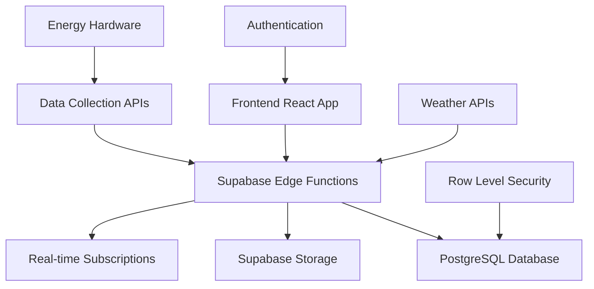
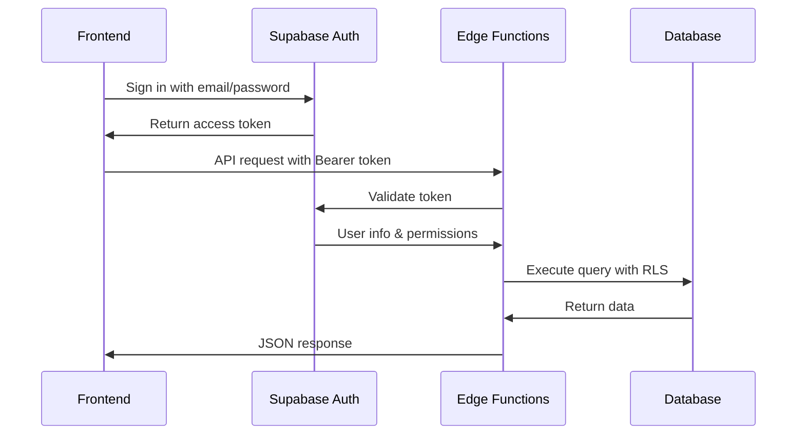
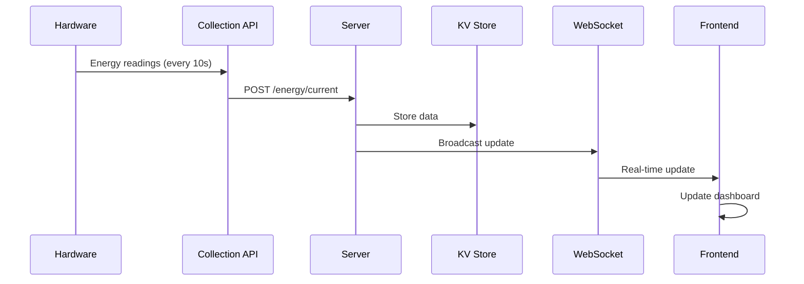
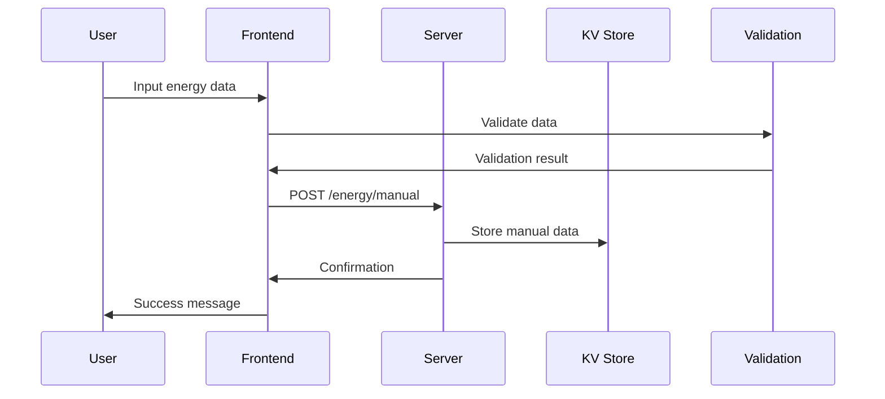
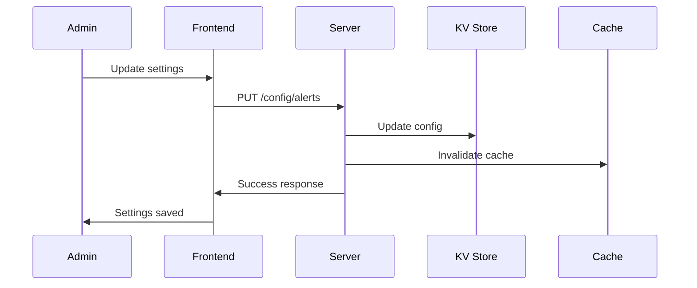

# Backend Architecture Documentation

## Overview

The Campus Energy Platform backend is built on **Supabase**, providing a robust, scalable, and secure foundation for the renewable energy management system. This document explains the backend architecture, data flow, and integration patterns.

## Supabase Architecture

### Core Components



### Database Layer (PostgreSQL)

#### Primary Tables

1. **kv_store_7e64cf15** (Key-Value Store)
   - **Purpose**: Flexible data storage for energy metrics, configurations, and cache
   - **Schema**:
     ```sql
     CREATE TABLE kv_store_7e64cf15 (
       id TEXT PRIMARY KEY,
       value JSONB NOT NULL,
       created_at TIMESTAMP WITH TIME ZONE DEFAULT NOW(),
       updated_at TIMESTAMP WITH TIME ZONE DEFAULT NOW()
     );
     ```
   - **Use Cases**:
     - Real-time energy data storage
     - Configuration settings
     - User preferences
     - Alert thresholds
     - Historical data aggregations

#### Key-Value Operations

The KV store provides flexible CRUD operations:

```typescript
// Available operations in /supabase/functions/server/kv_store.tsx
const kv = {
  get(key: string): Promise<any>           // Get single value
  set(key: string, value: any): Promise<void>  // Set single value
  del(key: string): Promise<void>          // Delete single value
  mget(keys: string[]): Promise<any[]>     // Get multiple values
  mset(data: Record<string, any>): Promise<void>  // Set multiple values
  mdel(keys: string[]): Promise<void>      // Delete multiple values
  getByPrefix(prefix: string): Promise<any[]>     // Get all keys with prefix
}
```

#### Common Data Patterns

```typescript
// Energy data storage
kv.set('energy:current', {
  timestamp: '2025-01-15T10:30:00Z',
  solar_gen_kW: 85.5,
  wind_gen_kW: 42.1,
  load_demand_kW: 95.2,
  battery_soc_percent: 78
});

// User settings
kv.set('user:123:settings', {
  notifications: true,
  dashboardLayout: 'compact',
  weatherApiKey: 'encrypted_key'
});

// Alert configurations
kv.set('alerts:thresholds', {
  batteryLow: 20,
  gridUsageHigh: 100,
  solarGenerationLow: 50
});
```

### Edge Functions (Server Layer)

Located in `/supabase/functions/server/index.tsx`, the server provides:

#### API Endpoints

All endpoints are prefixed with `/make-server-7e64cf15`:

```typescript
// Energy data endpoints
GET  /make-server-7e64cf15/energy/current     // Current energy data
GET  /make-server-7e64cf15/energy/forecast    // Forecast data
GET  /make-server-7e64cf15/energy/historical  // Historical data
POST /make-server-7e64cf15/energy/manual      // Manual data entry

// Configuration endpoints
GET  /make-server-7e64cf15/config/assets      // Energy assets
PUT  /make-server-7e64cf15/config/assets      // Update assets
GET  /make-server-7e64cf15/config/alerts      // Alert thresholds
PUT  /make-server-7e64cf15/config/alerts      // Update thresholds

// User management endpoints
GET  /make-server-7e64cf15/users              // List users
POST /make-server-7e64cf15/users              // Create user
PUT  /make-server-7e64cf15/users/:id          // Update user
DEL  /make-server-7e64cf15/users/:id          // Delete user

// System endpoints
GET  /make-server-7e64cf15/health             // Health check
GET  /make-server-7e64cf15/metrics            // System metrics
```

#### Server Configuration

```typescript
// Server setup in /supabase/functions/server/index.tsx
import { Hono } from 'npm:hono';
import { cors } from 'npm:hono/cors';
import { logger } from 'npm:hono/logger';

const app = new Hono();

// Middleware
app.use('*', cors({
  origin: '*',
  allowMethods: ['GET', 'POST', 'PUT', 'DELETE', 'OPTIONS'],
  allowHeaders: ['Content-Type', 'Authorization']
}));

app.use('*', logger(console.log));

// Route prefix
app.basePath('/make-server-7e64cf15');

// Start server
Deno.serve(app.fetch);
```

### Authentication & Security

#### Authentication Flow



#### Security Features

1. **Row Level Security (RLS)**
   ```sql
   -- Example RLS policy
   CREATE POLICY "Users can only access their own data" ON kv_store_7e64cf15
   FOR ALL USING (
     id LIKE 'user:' || auth.uid() || ':%'
   );
   ```

2. **API Key Protection**
   ```typescript
   // Protected route example
   app.get('/protected-endpoint', async (c) => {
     const token = c.req.header('Authorization')?.split(' ')[1];
     const { data: user } = await supabase.auth.getUser(token);
     
     if (!user) {
       return c.json({ error: 'Unauthorized' }, 401);
     }
     
     // Process request...
   });
   ```

### Real-time Features

#### WebSocket Integration

The platform supports real-time updates through:

1. **Supabase Real-time Subscriptions**
   ```typescript
   // Frontend subscription
   const subscription = supabase
     .channel('energy-updates')
     .on('postgres_changes', 
       { 
         event: '*', 
         schema: 'public', 
         table: 'kv_store_7e64cf15',
         filter: 'id=eq.energy:current'
       },
       (payload) => {
         updateDashboard(payload.new);
       }
     )
     .subscribe();
   ```

2. **WebSocket Service** (Development)
   ```typescript
   // Simulated WebSocket for development
   websocketService.on('energy_data_update', (data) => {
     // Update UI components
     setCurrentData(data);
   });
   ```

### Storage Layer

#### File Storage Structure

```
supabase-storage/
├── make-7e64cf15-reports/          # Generated reports
│   ├── daily/
│   ├── weekly/
│   └── monthly/
├── make-7e64cf15-exports/          # Data exports
│   ├── csv/
│   ├── pdf/
│   └── json/
└── make-7e64cf15-assets/           # Static assets
    ├── images/
    └── documents/
```

#### Storage Operations

```typescript
// Upload report
const { data, error } = await supabase.storage
  .from('make-7e64cf15-reports')
  .upload(`daily/report-${date}.pdf`, file);

// Generate signed URL
const { data } = await supabase.storage
  .from('make-7e64cf15-reports')
  .createSignedUrl('daily/report-2025-01-15.pdf', 3600);
```

## Data Flow Patterns

### Real-time Energy Data



### Manual Data Entry



### Configuration Management



## Environment Variables

### Required Configuration

```env
# Supabase Configuration
SUPABASE_URL=https://your-project.supabase.co
SUPABASE_ANON_KEY=your-anon-key
SUPABASE_SERVICE_ROLE_KEY=your-service-role-key

# API Integration (Production)
ENERGY_API_TOKEN=your-energy-system-token
WEATHER_API_TOKEN=your-weather-service-token

# WebSocket Configuration
WEBSOCKET_URL=wss://your-websocket-server.com
WEBSOCKET_ENABLE_FALLBACK=true

# Security
JWT_SECRET=your-jwt-secret
ENCRYPTION_KEY=your-encryption-key
```

## Performance Optimization

### Database Optimization

1. **Indexing Strategy**
   ```sql
   -- Index for time-series queries
   CREATE INDEX idx_kv_energy_timestamp 
   ON kv_store_7e64cf15 ((value->>'timestamp'))
   WHERE id LIKE 'energy:%';

   -- Index for user data
   CREATE INDEX idx_kv_user_data 
   ON kv_store_7e64cf15 (id)
   WHERE id LIKE 'user:%';
   ```

2. **Data Partitioning**
   ```typescript
   // Partition historical data by month
   const monthKey = `energy:historical:${year}-${month}`;
   await kv.set(monthKey, monthlyData);
   ```

3. **Caching Strategy**
   ```typescript
   // Cache frequently accessed data
   const getCachedData = async (key: string) => {
     const cached = await kv.get(`cache:${key}`);
     if (cached && !isExpired(cached.timestamp)) {
       return cached.data;
     }
     
     const fresh = await fetchFreshData(key);
     await kv.set(`cache:${key}`, {
       data: fresh,
       timestamp: Date.now()
     });
     
     return fresh;
   };
   ```

### API Optimization

1. **Request Batching**
   ```typescript
   // Batch multiple operations
   app.post('/batch', async (c) => {
     const operations = await c.req.json();
     const results = await Promise.allSettled(
       operations.map(op => executeOperation(op))
     );
     return c.json(results);
   });
   ```

2. **Response Compression**
   ```typescript
   import { compress } from 'npm:hono/compress';
   
   app.use('*', compress());
   ```

## Monitoring & Logging

### Health Monitoring

```typescript
// Health check endpoint
app.get('/health', async (c) => {
  const checks = {
    database: await checkDatabaseConnection(),
    storage: await checkStorageAccess(),
    apis: await checkExternalAPIs(),
    websocket: await checkWebSocketStatus()
  };
  
  const isHealthy = Object.values(checks).every(Boolean);
  
  return c.json({
    status: isHealthy ? 'healthy' : 'unhealthy',
    checks,
    timestamp: new Date().toISOString()
  });
});
```

### Error Logging

```typescript
// Centralized error handling
app.onError((err, c) => {
  console.error({
    error: err.message,
    stack: err.stack,
    request: {
      method: c.req.method,
      url: c.req.url,
      headers: Object.fromEntries(c.req.raw.headers)
    },
    timestamp: new Date().toISOString()
  });
  
  return c.json({
    error: 'Internal Server Error',
    timestamp: new Date().toISOString()
  }, 500);
});
```

### Performance Metrics

```typescript
// Request timing middleware
app.use('*', async (c, next) => {
  const start = Date.now();
  await next();
  const duration = Date.now() - start;
  
  console.log({
    method: c.req.method,
    path: c.req.path,
    duration,
    status: c.res.status
  });
});
```

## Deployment & Scaling

### Supabase Project Setup

1. **Database Configuration**
   - Enable Row Level Security
   - Configure connection pooling
   - Set up read replicas (if needed)

2. **Edge Functions Deployment**
   ```bash
   # Deploy edge functions
   supabase functions deploy server --project-ref your-project-ref
   
   # Set environment variables
   supabase secrets set ENERGY_API_TOKEN=your-token --project-ref your-project-ref
   ```

3. **Storage Configuration**
   ```sql
   -- Create storage buckets
   INSERT INTO storage.buckets (id, name, public) VALUES 
   ('make-7e64cf15-reports', 'make-7e64cf15-reports', false),
   ('make-7e64cf15-exports', 'make-7e64cf15-exports', false);
   ```

### Scaling Considerations

1. **Horizontal Scaling**
   - Use Supabase's built-in load balancing
   - Implement read replicas for analytics queries
   - Consider edge deployment for global access

2. **Data Archiving**
   ```typescript
   // Archive old data to storage
   const archiveOldData = async () => {
     const cutoffDate = new Date();
     cutoffDate.setMonth(cutoffDate.getMonth() - 6);
     
     const oldData = await kv.getByPrefix(`energy:historical:${cutoffDate.getFullYear()}`);
     
     // Upload to storage
     await supabase.storage
       .from('make-7e64cf15-archives')
       .upload(`historical-${cutoffDate.toISOString()}.json`, JSON.stringify(oldData));
     
     // Remove from active storage
     await kv.mdel(oldData.map(item => item.key));
   };
   ```

## Security Best Practices

### Data Protection

1. **Encryption at Rest**
   ```typescript
   // Encrypt sensitive data before storage
   const encryptData = (data: any) => {
     return encrypt(JSON.stringify(data), process.env.ENCRYPTION_KEY);
   };
   
   await kv.set('sensitive:data', encryptData(sensitiveInfo));
   ```

2. **API Rate Limiting**
   ```typescript
   import { rateLimiter } from 'npm:hono-rate-limiter';
   
   app.use('/api/*', rateLimiter({
     windowMs: 15 * 60 * 1000, // 15 minutes
     max: 100 // limit each IP to 100 requests per windowMs
   }));
   ```

3. **Input Validation**
   ```typescript
   import { validator } from 'npm:hono/validator';
   
   app.post('/energy/manual', 
     validator('json', (value, c) => {
       // Validate energy data format
       if (!isValidEnergyData(value)) {
         return c.text('Invalid data format', 400);
       }
       return value;
     }),
     async (c) => {
       // Process validated data
     }
   );
   ```

## Troubleshooting Guide

### Common Issues

1. **Database Connection Issues**
   ```typescript
   // Test database connectivity
   const testConnection = async () => {
     try {
       const { data, error } = await supabase
         .from('kv_store_7e64cf15')
         .select('id')
         .limit(1);
       
       return !error;
     } catch (err) {
       console.error('Database connection failed:', err);
       return false;
     }
   };
   ```

2. **Edge Function Timeout**
   ```typescript
   // Implement timeout handling
   const withTimeout = (promise: Promise<any>, ms: number) => {
     return Promise.race([
       promise,
       new Promise((_, reject) => 
         setTimeout(() => reject(new Error('Timeout')), ms)
       )
     ]);
   };
   ```

3. **Memory Management**
   ```typescript
   // Clean up resources
   const cleanupResources = () => {
     // Clear large objects from memory
     cache.clear();
     
     // Force garbage collection (if available)
     if (global.gc) {
       global.gc();
     }
   };
   ```

### Debugging Tools

1. **Enable Debug Logging**
   ```typescript
   // Environment-based logging
   const debug = process.env.NODE_ENV === 'development';
   
   const log = (message: string, data?: any) => {
     if (debug) {
       console.log(`[DEBUG] ${message}`, data);
     }
   };
   ```

2. **Health Check Dashboard**
   ```typescript
   app.get('/debug/status', async (c) => {
     return c.json({
       environment: process.env.NODE_ENV,
       uptime: process.uptime(),
       memory: process.memoryUsage(),
       database: await testConnection(),
       version: '1.0.0'
     });
   });
   ```

## Support & Maintenance

### Regular Maintenance Tasks

1. **Database Cleanup**
   - Archive old energy data
   - Remove expired cache entries
   - Optimize database indexes

2. **Security Updates**
   - Rotate API keys monthly
   - Update dependencies
   - Review access logs

3. **Performance Monitoring**
   - Monitor response times
   - Check database query performance
   - Review error rates

### Getting Help

- **Supabase Documentation**: https://supabase.com/docs
- **Platform Issues**: energy-tech@institute.edu
- **Emergency Support**: Available 24/7 for critical issues

---

This backend architecture provides a solid foundation for the Campus Energy Platform, with built-in scalability, security, and monitoring capabilities.