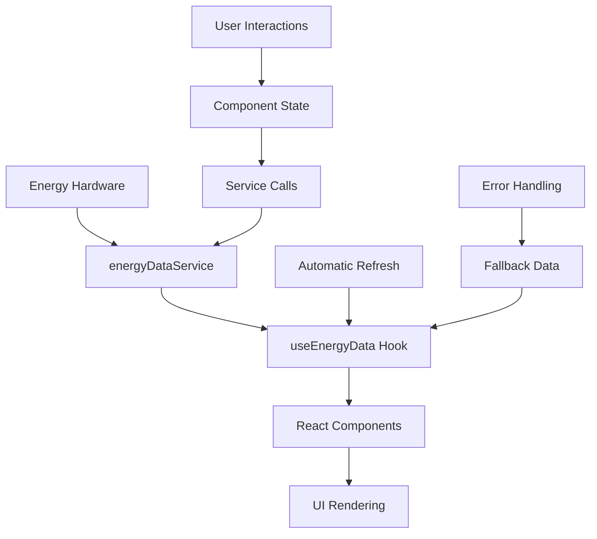

# Component Architecture Guide

## Overview

This guide provides detailed documentation for the modular component architecture of the Campus Energy Platform. The application is built using React with TypeScript, following modern patterns for maintainability and scalability.

## Component Hierarchy

```
App.tsx (Root)
├── Navigation.tsx (Sidebar)
├── Header.tsx (Top navigation)
├── Main Content Area
│   ├── Dashboard.tsx
│   ├── ForecastPlanning.tsx
│   ├── Analytics.tsx
│   └── Settings.tsx
└── Footer.tsx
```

## Core Components

### App.tsx (Root Component)
**Purpose**: Main application orchestrator
**Responsibilities**:
- Route management between pages
- Global state coordination
- Layout structure

```typescript
interface AppState {
  currentPage: 'dashboard' | 'forecast' | 'analytics' | 'settings';
}
```

**Key Features**:
- Responsive layout with sidebar
- Dynamic page title and subtitle
- Centralized navigation state

### Layout Components

#### Header.tsx
**Location**: `/components/layout/Header.tsx`
**Purpose**: Top navigation bar with status and controls

**Features**:
- Real-time clock and date display
- Search functionality
- Notification center
- User profile menu
- Theme toggle

```typescript
interface HeaderProps {
  title: string;
  subtitle?: string;
}
```

#### Footer.tsx
**Location**: `/components/layout/Footer.tsx`
**Purpose**: Application footer with links and information

**Features**:
- Platform information and links
- Contact details
- Quick navigation
- Copyright and legal info

#### Navigation.tsx
**Location**: `/components/Navigation.tsx`
**Purpose**: Sidebar navigation with responsive mobile menu

**Features**:
- Desktop sidebar navigation
- Mobile hamburger menu
- Active page highlighting
- System status indicator

```typescript
interface NavigationProps {
  currentPage: string;
  onPageChange: (page: string) => void;
}
```

## Page Components

### Dashboard.tsx
**Purpose**: Main energy monitoring interface
**Data Sources**: 
- `useCurrentEnergyData()` hook
- `useForecastData()` hook

**Key Sections**:
1. **Status Bar**: Update indicators and controls
2. **Metrics Grid**: Energy generation and consumption cards
3. **Charts**: Real-time and forecast visualizations
4. **Recommendations**: AI-powered suggestions
5. **Summary Cards**: Key performance indicators

**State Management**:
```typescript
const {
  currentData,
  metrics,
  recommendations,
  alerts,
  isLoading,
  error,
  refresh
} = useCurrentEnergyData(30000); // 30-second refresh
```

### ForecastPlanning.tsx
**Purpose**: Energy forecasting and load planning interface

**Key Features**:
- Time-block energy planning
- Weather-based forecasting
- Load shifting recommendations
- Optimal operation windows

**Components Used**:
- `EnergyChart` for forecast visualization
- `Card` components for time block display
- `Badge` components for status indicators

### Analytics.tsx
**Purpose**: Historical data analysis and reporting

**Key Features**:
- Historical trend analysis
- Performance metrics
- Carbon footprint tracking
- Export functionality (CSV, PDF)

**Data Processing**:
```typescript
const dailySummaries = historicalData.reduce((acc, data) => {
  const date = new Date(data.timestamp).toDateString();
  if (!acc[date]) acc[date] = [];
  acc[date].push(data);
  return acc;
}, {} as Record<string, EnergyData[]>);
```

### Settings.tsx
**Purpose**: System configuration and administration

**Key Sections**:
1. **Energy Assets**: Hardware configuration
2. **Alert Thresholds**: Notification settings
3. **User Management**: Access control
4. **System Integrations**: API configurations

**State Management**:
```typescript
const [assets, setAssets] = useState<EnergyAsset[]>([]);
const [users, setUsers] = useState<User[]>([]);
const [alertThresholds, setAlertThresholds] = useState<AlertThreshold[]>([]);
```

## Utility Components

### EnergyMetricCard.tsx
**Purpose**: Reusable metric display component

```typescript
interface EnergyMetricCardProps {
  title: string;
  value: number;
  unit: string;
  icon: LucideIcon;
  trend?: 'up' | 'down' | 'stable';
  status?: 'good' | 'warning' | 'critical';
  subtitle?: string;
  className?: string;
}
```

**Features**:
- Status-based color coding
- Trend indicators
- Icon integration
- Hover animations

### EnergyChart.tsx
**Purpose**: Flexible chart component for energy data visualization

```typescript
interface EnergyChartProps {
  data: EnergyData[];
  title: string;
  type?: 'line' | 'area' | 'bar';
  dataKeys: {
    key: keyof EnergyData;
    name: string;
    color: string;
  }[];
  height?: number;
}
```

**Chart Types**:
- **Line Charts**: Trend analysis
- **Area Charts**: Generation vs consumption
- **Bar Charts**: Comparative data

**Features**:
- Responsive design
- Interactive tooltips
- Gradient fills
- Time-based x-axis formatting

## Custom Hooks

### useEnergyData.ts
**Purpose**: Centralized energy data management

**Hook Variants**:
```typescript
// Main hook with full configuration
useEnergyData(options: UseEnergyDataOptions)

// Specialized hooks
useCurrentEnergyData(refreshInterval: number)
useForecastData(hours: number)
useHistoricalData(days: number)
```

**Features**:
- Automatic data refresh
- Error handling and fallbacks
- Loading state management
- Manual refresh capabilities

**State Interface**:
```typescript
interface EnergyDataState {
  currentData: EnergyData | null;
  forecastData: EnergyData[];
  historicalData: EnergyData[];
  metrics: CurrentMetrics | null;
  recommendations: string[];
  alerts: Array<{type: 'warning' | 'error' | 'info', message: string}>;
  isLoading: boolean;
  error: string | null;
  lastUpdated: Date | null;
}
```

## Service Layer

### energyDataService.ts
**Purpose**: Data fetching and API integration layer

**Key Methods**:
```typescript
class EnergyDataService {
  getCurrentData(): Promise<EnergyData>
  getForecastData(hours: number): Promise<EnergyData[]>
  getHistoricalData(days: number): Promise<EnergyData[]>
  getCurrentMetrics(data: EnergyData): CurrentMetrics
  getRecommendations(data: EnergyData): string[]
  getAlerts(data: EnergyData): Alert[]
  checkApiHealth(): Promise<boolean>
}
```

**Features**:
- Singleton pattern for consistent state
- Fallback to simulated data
- Error handling and retry logic
- API health monitoring

## Data Flow Architecture



## State Management Patterns

### Local Component State
Used for:
- UI-specific state (modals, dropdowns)
- Form inputs
- Temporary selections

```typescript
const [isModalOpen, setIsModalOpen] = useState(false);
const [selectedAsset, setSelectedAsset] = useState<EnergyAsset | null>(null);
```

### Custom Hook State
Used for:
- Shared data across components
- API data management
- Complex state logic

```typescript
// Shared across multiple components
const { currentData, isLoading, refresh } = useCurrentEnergyData();
```

### Service Layer State
Used for:
- Global configuration
- API endpoints
- Data source switching

```typescript
// Service configuration
energyDataService.setDataSource(false); // Switch to real APIs
energyDataService.updateApiEndpoints(newEndpoints);
```

## Error Handling Strategy

### Component Level
```typescript
if (error) {
  return (
    <div className="error-container">
      <AlertTriangle className="h-12 w-12 text-destructive" />
      <div className="text-center">
        <h3>Error Loading Data</h3>
        <p>{error}</p>
        <Button onClick={refresh}>Retry</Button>
      </div>
    </div>
  );
}
```

### Service Level
```typescript
try {
  const data = await fetch(apiEndpoint);
  return await data.json();
} catch (error) {
  console.error('API Error:', error);
  // Fallback to simulated data
  return energySimulator.generateCurrentData();
}
```

### Hook Level
```typescript
const [error, setError] = useState<string | null>(null);

const handleError = (error: unknown) => {
  const message = error instanceof Error ? error.message : 'Unknown error';
  setError(message);
  console.error('Hook Error:', error);
};
```

## Performance Optimization

### Memoization
```typescript
const expensiveCalculation = useMemo(() => {
  return processEnergyData(historicalData);
}, [historicalData]);

const memoizedComponent = memo(EnergyMetricCard);
```

### Lazy Loading
```typescript
const Analytics = lazy(() => import('./components/Analytics'));
const Settings = lazy(() => import('./components/Settings'));
```

### Debounced Updates
```typescript
const debouncedRefresh = useCallback(
  debounce(() => {
    refreshData();
  }, 1000),
  [refreshData]
);
```

## Testing Strategy

### Component Testing
```typescript
import { render, screen } from '@testing-library/react';
import { Dashboard } from './Dashboard';

test('renders dashboard with energy metrics', () => {
  render(<Dashboard />);
  expect(screen.getByText('Solar Generation')).toBeInTheDocument();
});
```

### Hook Testing
```typescript
import { renderHook } from '@testing-library/react-hooks';
import { useEnergyData } from './useEnergyData';

test('should fetch energy data', async () => {
  const { result, waitForNextUpdate } = renderHook(() => useEnergyData());
  
  await waitForNextUpdate();
  
  expect(result.current.currentData).toBeDefined();
});
```

### Service Testing
```typescript
import { energyDataService } from './energyDataService';

test('should return current energy data', async () => {
  const data = await energyDataService.getCurrentData();
  
  expect(data).toHaveProperty('timestamp');
  expect(data.solar_gen_kW).toBeGreaterThanOrEqual(0);
});
```

## Accessibility Guidelines

### Semantic HTML
- Use proper heading hierarchy
- Implement ARIA labels
- Ensure keyboard navigation
- Provide focus indicators

### Color and Contrast
- Maintain WCAG 2.1 AA compliance
- Provide alternative indicators beyond color
- Support high contrast mode
- Test with color blindness simulators

### Screen Reader Support
```typescript
<button 
  aria-label="Refresh energy data"
  aria-describedby="refresh-description"
>
  <RefreshCw className="h-4 w-4" />
</button>
<div id="refresh-description" className="sr-only">
  Updates all energy metrics and forecasts
</div>
```

## Deployment Considerations

### Environment Configuration
```typescript
// Component should adapt to environment
const isDevelopment = process.env.NODE_ENV === 'development';
const apiBaseUrl = process.env.VITE_API_BASE_URL || 'http://localhost:3000';
```

### Build Optimization
- Tree shaking for unused code
- Code splitting by routes
- Bundle size analysis
- Performance monitoring

### Production Monitoring
- Error boundary implementation
- Performance metrics collection
- User interaction tracking
- API usage monitoring

## Contributing Guidelines

### Component Creation Checklist
- [ ] TypeScript interfaces defined
- [ ] Props validation implemented
- [ ] Error boundaries added
- [ ] Accessibility features included
- [ ] Unit tests written
- [ ] Documentation updated

### Code Review Focus Areas
- Component reusability
- Performance implications
- Accessibility compliance
- Error handling completeness
- Type safety maintenance

---

For detailed implementation examples, refer to the source code in `/components/` directory.