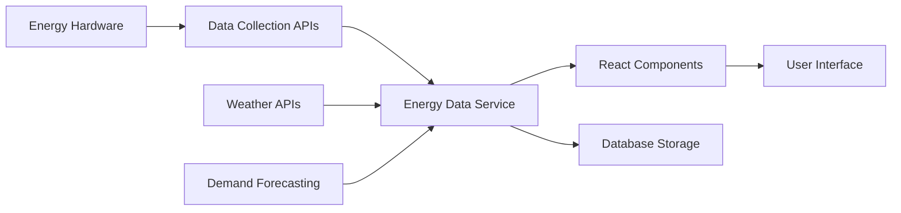

# 🌱 GreenGrid - Smart Renewable Energy Management Platform

## Overview

GreenGrid is a comprehensive renewable energy management system designed specifically for educational institutes in Rajasthan. It provides a vendor-neutral orchestration layer that unifies existing renewable energy hardware (solar panels, wind turbines, batteries) and enables intelligent energy optimization through real-time monitoring, forecasting, and automated recommendations.

## Key Features

### 🔋 Real-time Energy Monitoring
- Live tracking of solar generation, wind generation, battery status, and grid usage
- **New**: Comprehensive real-time energy visualization dashboard
- **New**: Current Energy Mix pie chart showing source distribution
- **New**: Live Energy Flow monitor with animated progress bars
- **New**: Real-time 10-minute consumption vs generation trend
- **New**: Energy Sources stacked bar chart for instant source breakdown
- Dynamic energy flow visualization with interactive charts
- Generation vs Demand forecasting charts
- Battery & Grid trend analysis
- Instant alerts and notifications for system anomalies
- Demo mode with realistic Rajasthan energy data simulation

### 📊 Intelligent Forecasting
- Weather-based energy generation predictions
- Load demand forecasting using historical patterns
- Smart recommendations for load shifting and battery optimization
- AI-powered efficiency optimization suggestions
- Real-time alerts for high grid demand periods

### 📈 Advanced Analytics
- Historical performance analysis
- Carbon footprint tracking and reporting
- Energy efficiency metrics and trends
- Exportable reports for compliance and decision-making

### ⚙️ System Administration
- Asset management for energy hardware
- User access control and permissions
- Alert threshold configuration
- API integration settings

## Architecture

### Frontend Components
```
src/
├── components/
│   ├── layout/           # Header, Footer, Navigation
│   ├── Dashboard.tsx     # Main energy dashboard
│   ├── ForecastPlanning.tsx # Energy forecasting interface
│   ├── Analytics.tsx     # Historical data analysis
│   ├── Settings.tsx      # System configuration
│   └── ui/               # Reusable UI components
├── hooks/
│   └── useEnergyData.ts  # Custom React hooks for data management
├── services/
│   └── energyDataService.ts # Data service layer
└── utils/
    └── energyData.ts     # Data models and simulation
```

### Backend Integration
- Supabase database for data persistence
- Edge functions for server-side processing
- RESTful API endpoints for external system integration
- Real-time data synchronization

## Data Flow



## Installation & Setup

### Prerequisites
- Node.js 18+ and npm/yarn
- Supabase account and project
- API keys for weather services (optional)

### Environment Configuration
Create a `.env` file in the root directory:
```env
# Supabase Configuration
SUPABASE_URL=your_supabase_url
SUPABASE_ANON_KEY=your_supabase_anon_key
SUPABASE_SERVICE_ROLE_KEY=your_supabase_service_role_key

# API Keys (for production)
ENERGY_API_TOKEN=your_energy_system_api_token
WEATHER_API_TOKEN=your_weather_service_api_token
```

### Development Setup
```bash
# Install dependencies
npm install

# Start development server
npm run dev

# Build for production
npm run build
```

## API Integration

### Current Implementation
The platform currently uses simulated data for development and demonstration purposes. All API integration code is prepared but commented out in the service layer.

### Production API Integration
To connect to real energy systems:

1. **Update Energy Data Service** (`/services/energyDataService.ts`)
   - Uncomment API integration code
   - Configure actual API endpoints
   - Add authentication headers

2. **Configure API Endpoints**
   ```typescript
   const apiEndpoints = {
     currentData: 'https://your-energy-api.com/current',
     forecastData: 'https://your-energy-api.com/forecast',
     historicalData: 'https://your-energy-api.com/historical',
     weatherData: 'https://your-weather-api.com/current',
     meterReadings: 'https://your-meter-api.com/readings',
     batteryStatus: 'https://your-battery-api.com/status'
   };
   ```

3. **Data Transformation**
   Ensure API responses are transformed to match the `EnergyData` interface:
   ```typescript
   interface EnergyData {
     timestamp: string;
     solar_gen_kW: number;
     wind_gen_kW: number;
     load_demand_kW: number;
     battery_soc_percent: number;
     grid_import_kW: number;
     grid_export_kW: number;
     weather: string;
     forecast: 'Surplus' | 'Deficit' | 'Balanced';
     temperature: number;
     carbon_saved_kg: number;
   }
   ```

## Hardware Compatibility

### Supported Systems
- **Solar Inverters**: SMA, Fronius, ABB, Delta
- **Wind Turbines**: Vestas, Enercon, Nordex
- **Battery Systems**: Tesla Powerpack, LG Chem, BYD
- **Smart Meters**: Schneider Electric, Siemens, L&T
- **Weather Stations**: Davis Instruments, Campbell Scientific

### Communication Protocols
- Modbus TCP/RTU
- MQTT
- RESTful APIs
- OPC UA
- SunSpec Alliance standards

## User Roles & Permissions

### Administrator
- Full system access
- User management
- System configuration
- API key management

### Operator
- Energy monitoring and control
- Report generation
- Alert management
- Basic system settings

### Viewer
- Read-only dashboard access
- Report viewing
- Basic analytics

## Security Features

- JWT-based authentication
- Role-based access control (RBAC)
- API key encryption
- Audit logging
- Secure communication (HTTPS/TLS)

## Performance Optimization

### Data Management
- Efficient caching strategies
- Incremental data loading
- Background data refresh
- Optimized database queries

### UI/UX
- Responsive design for all devices
- Progressive loading indicators
- Error handling and fallbacks
- Accessibility compliance (WCAG 2.1)

## Monitoring & Alerts

### System Health
- API connectivity monitoring
- Database performance tracking
- Real-time error logging
- Automated backup systems

### Energy Alerts
- Battery low warnings
- High grid usage notifications
- Equipment malfunction alerts
- Performance degradation notices

## Reporting & Compliance

### Automated Reports
- Daily energy summaries
- Weekly performance analysis
- Monthly sustainability reports
- Annual carbon footprint assessments

### Export Formats
- PDF reports for presentations
- CSV data for analysis
- JSON for system integration
- Excel for financial analysis

## Troubleshooting

### Common Issues

1. **Data Not Loading**
   - Check API connectivity
   - Verify authentication tokens
   - Review network configuration

2. **Slow Performance**
   - Check database performance
   - Review data refresh intervals
   - Optimize query parameters

3. **Authentication Errors**
   - Verify Supabase configuration
   - Check API key validity
   - Review user permissions

### Support Resources
- Technical documentation: `/docs/technical/`
- API reference: `/docs/api/`
- Troubleshooting guide: `/docs/troubleshooting/`
- Video tutorials: Available on platform help section

## Roadmap

### Phase 1 (Current)
- ✅ Core dashboard functionality
- ✅ Enhanced dashboard with interactive charts
- ✅ Real-time monitoring with live data simulation
- ✅ Advanced forecasting with Generation vs Demand analysis
- ✅ Battery & Grid trend monitoring
- ✅ Smart recommendations system
- ✅ Demo mode for easy testing
- ✅ User management and institute setup

### Phase 2 (Next 3 months)
- 🔄 Machine learning forecasting
- 🔄 Advanced analytics
- 🔄 Mobile app development
- 🔄 Multi-campus support

### Phase 3 (6-12 months)
- 📅 IoT device integration
- 📅 Blockchain energy trading
- 📅 AI-powered optimization
- 📅 Carbon credit tracking

## Contributing

### Development Guidelines
1. Follow React/TypeScript best practices
2. Maintain component modularity
3. Write comprehensive tests
4. Document all API changes
5. Follow semantic versioning

### Code Style
- Use ESLint and Prettier configurations
- Follow conventional commit messages
- Maintain 80% test coverage
- Document all public APIs

## License

This project is licensed under the MIT License. See [LICENSE](LICENSE) file for details.

## Contact & Support

- **Technical Support**: energy-support@institute.edu
- **Business Inquiries**: energy-business@institute.edu
- **Documentation**: Available at `/docs/`
- **Community**: GitHub Discussions

---

## 🎯 Demo Mode

GreenGrid now includes a comprehensive demo mode that showcases all platform features with realistic data simulation specifically designed for Rajasthan institutes.

### Demo Features
- **Enhanced Dashboard**: All users now access the full enhanced dashboard with interactive charts
- **Real-time Data Simulation**: Experience dynamic energy data with automatic updates every 30 seconds
- **Realistic Rajasthan Data**: Weather patterns and energy consumption modeled after Rajasthan institutes
- **Complete Feature Set**: All charts, recommendations, and monitoring features enabled
- **No Setup Required**: Demo mode provides instant access without institute configuration
- **Advanced Visualizations**: Generation vs Demand charts, Battery & Grid trends, Smart recommendations

### Accessing Demo Mode
1. **From Landing Page**: Click "View Demo" button
2. **Direct Demo Access**: Both primary and secondary CTA buttons lead to live demo
3. **Auto-configured**: Automatically sets up demo institute profile (Rajasthan Institute of Technology)

### Demo Data Includes
- Solar generation patterns based on Rajasthan solar irradiance
- Wind generation data typical for Rajasthan wind patterns  
- Battery optimization scenarios for educational institutes
- Grid usage patterns for academic schedules
- Smart recommendations for energy efficiency

## 🚀 Quick Start

### 1. Clone and Setup
```bash
git clone https://github.com/your-username/greengrid.git
cd greengrid
npm install
```

### 2. Configure Environment
```bash
cp .env.example .env.local
# Edit .env.local with your Supabase credentials
```

### 3. Run Development Server
```bash
npm run dev
```

### 4. Deploy to Production
Follow the [Deployment Guide](./DEPLOYMENT_GUIDE.md) for complete setup instructions.

## 📚 Documentation

- **[Supabase Integration Guide](./SUPABASE_INTEGRATION.md)** - Backend setup and database configuration
- **[Deployment Guide](./DEPLOYMENT_GUIDE.md)** - Production deployment with GitHub Actions
- **[Component Guide](./COMPONENT_GUIDE.md)** - Frontend architecture and components
- **[API Integration](./API_INTEGRATION.md)** - External API setup and configuration

---

**Built with 🌱 for sustainable education in Rajasthan**